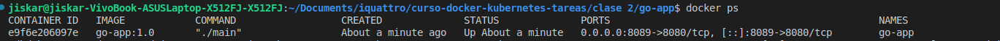
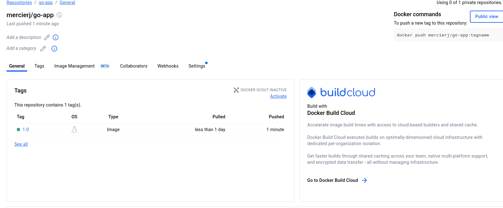

# Clase 2 - Dockerización de Mi Aplicación

## Aplicación

**Lenguaje:** Go
**Framework:** Chi
**Descripción:** API REST para gestión de usuarios

**Endpoints:** GET http://localhost:8089/users
- GET / - Página de bienvenida
- GET /users - Lista de usuarios
- GET /users/1 - Buscar usuario por id

## Dockerfile

\`\`\`dockerfile
# Stage 1: Build
FROM golang:1.22-alpine AS builder
...

# Stage 2: Production
FROM alpine:3.20
...
\`\`\`

**Explicación:**

| Stage | Propósito |
|-------|-----------|
| Build | Instalar todas las dependencias... |
| Production | Solo runtime... |

## Build

\`\`\`bash
docker build -t go-app:1.0 .
\`\`\`

## Testing

## Docker Hub

**URL:** https://hub.docker.com/repository/docker/mercierj/go-app/general

## Conclusiones

Aprendí a construir imagenes multistage.