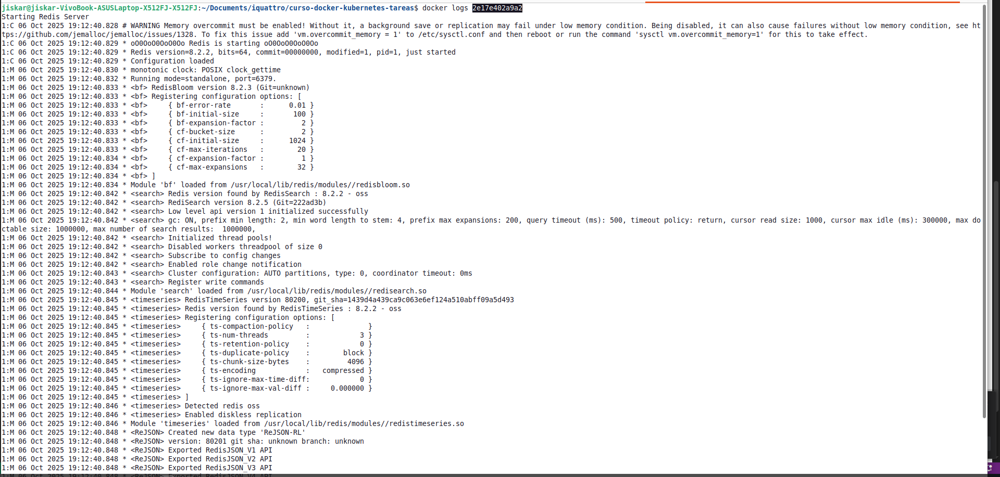

# Redis con Docker

# Comandos ejecutados

## 1. Descargar la imagen de Redis

```bash
docker pull redis
```

---

## 2. Levantar el contenedor

```bash
docker run -d --name mi-redis -p 6379:6379 redis
```

* `-d` → ejecuta el contenedor en segundo plano
* `--name mi-redis` → asigna un nombre al contenedor
* `-p 6379:6379` → expone el puerto de Redis en el host

---

## 3. Validación del contenedor

### Usando el cliente Redis dentro del contenedor:

```bash
docker exec -it mi-redis redis-cli ping
```

**Salida esperada:**

```
PONG
```

---

### Usando `docker ps` para confirmar que está corriendo:

```bash
docker ps
```

**Salida esperada:**

```
CONTAINER ID   IMAGE     COMMAND                  STATUS         PORTS                    NAMES
abc123xyz456   redis     "docker-entrypoint.s…"   Up 5 seconds   0.0.0.0:6379->6379/tcp   mi-redis
```

**Evidencias**

**1. Contenedor en ejecucion**

**2. Logs**

**2. Limpieza de contenedor**

**2. Limpieza de image**
