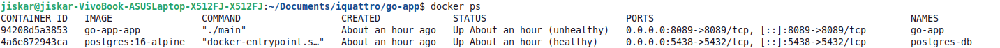
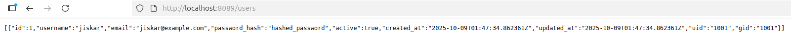
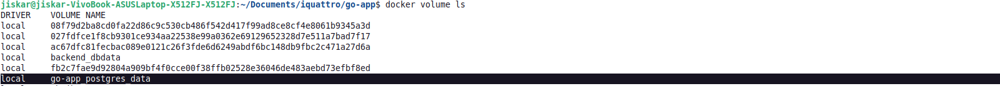
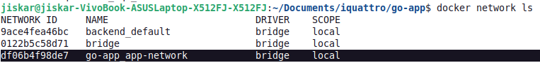
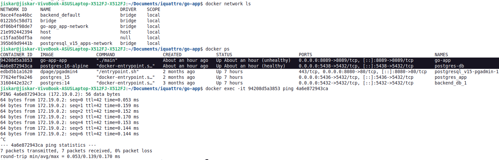

# Gestion de Usuarios

**Curso:** Docker & Kubernetes - Clase 3
**Estudiante:** Jiskar S. Justiniano Mercier

Api rest de usuario


## Stack

- **App:** GO
- **Base de datos:** PostgreSQL

## Ejecución

1. Clonar:
   ```bash
   git clone https://github.com/justinianom/go-app.git
   cd go-app

2. Levantar servicios:
    ```bash
   docker compose up -d
3. Acceder:
    ```bash
   API: http://localhost:8089

4. Cómo Probar
    ```bash
    curl --request POST \
    --url http://localhost:8089/users \
    --header 'content-type: application/json' \
    --header 'user-agent: vscode-restclient' \
    --data '{"username": "jiskar","email": "jiskar@example.com","password_hash": "hashed_password","active": true,"uid": "1001","gid": "1001"}'


5. Servicios corriendo:
   ```bash
   docker compose ps

### 5. Capturas de Pantalla


### Servicios corriendo


### API funcionando



### Volume


### network


### Ping
